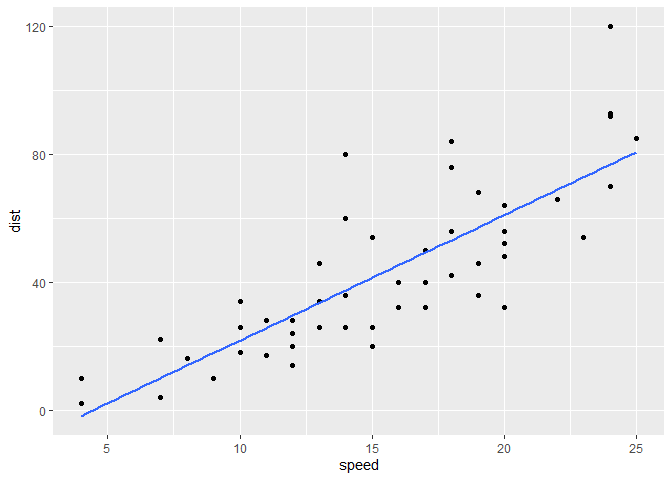
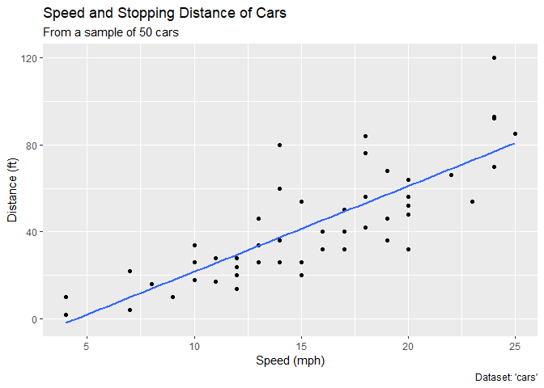
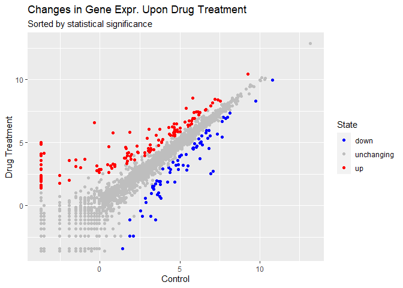
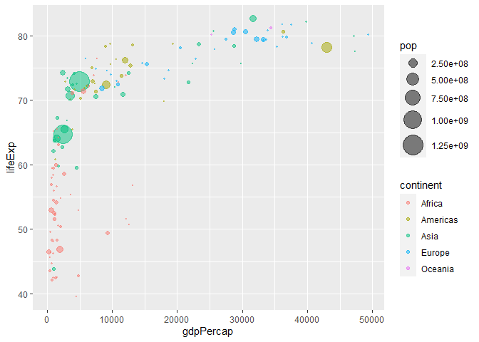
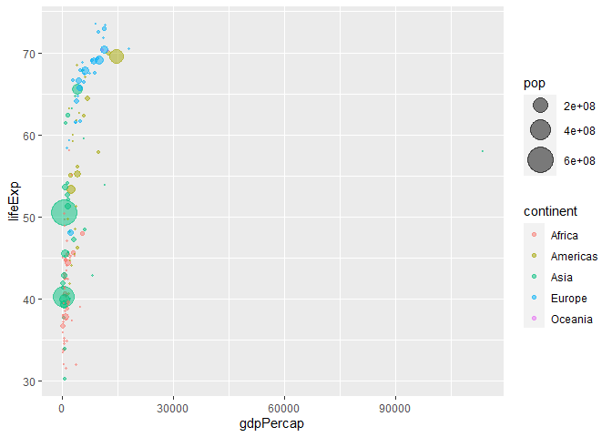
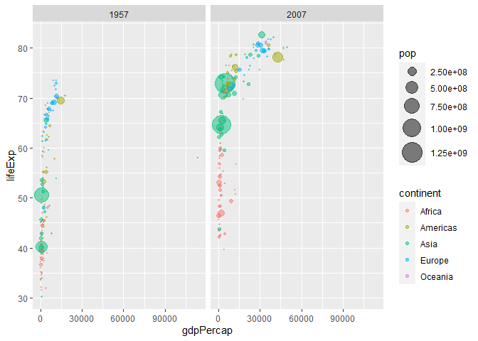
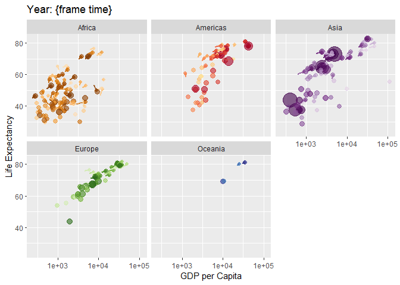
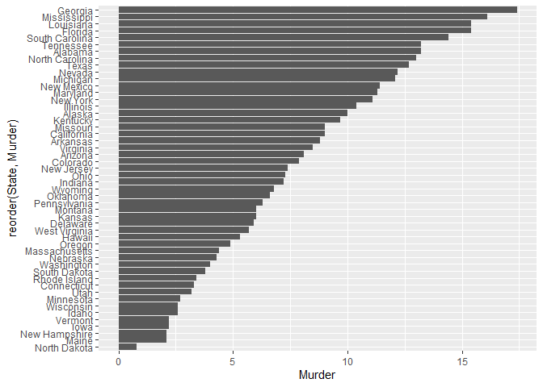

# Class 5 Data Vis with ggplot2
Andy Hsu

## Intro to GGPLOT

The ggplot2 package first needs to be installed as it does not come with
R by default.

The `install.packages()` function is used to do this.

``` r
head(cars)
```

      speed dist
    1     4    2
    2     4   10
    3     7    4
    4     7   22
    5     8   16
    6     9   10

To use ggplot, it needs to be loaded up before any of the package’s
functions can be called. This is done using the `library()` function.

``` r
library(ggplot2)
ggplot()
```


All ggplot figures have at least 3 things:

- Data (what we want to plot)
- Aesthetic Mapping (how the graph should be formatted)
- Geometry (how the graph should look)

``` r
ggplot(cars) +
  aes(x=speed,y=dist) +
  geom_point()
```


ggplot is not the only graphing system in R. There are many others, even
a “base R” system.

``` r
plot(cars)
```


## Scatterplots

Going back to ggplot, the `geom_smooth()` argument can be used to add a
trendline to a graph.

``` r
ggplot(cars) +
  aes(x=speed,y=dist) +
  geom_point() +
  geom_smooth(method="lm",se=F)
```

    `geom_smooth()` using formula = 'y ~ x'



Finally, various labels can be added to graphs using the `labs()`
function.

``` r
ggplot(cars) +
  aes(x=speed,y=dist) +
  geom_point() +
  geom_smooth(method="lm",se=F) +
  labs(title="Speed and Stopping Distance of Cars", x="Speed (mph)", y="Distance (ft)",
       subtitle="From a sample of 50 cars", caption="Dataset: 'cars'")
```

    `geom_smooth()` using formula = 'y ~ x'



## Plotting with \>2 Variables

ggplot can also handle datasets with more than 2 variables. First, we
create a basic scatterplot.

``` r
url <- "https://bioboot.github.io/bimm143_S20/class-material/up_down_expression.txt"
genes <- read.delim(url)
ggplot(genes) +
  aes(x=Condition1,y=Condition2) +
  geom_point()
```


Next, we can set color to the third variable and adjust our color
values.

``` r
ggplot(genes) +
  aes(x=Condition1,y=Condition2,col=State) +
  geom_point() +
  scale_color_manual(values=c("blue","gray","red"))
```


Finally again, we can add labels and finish out this plot.

``` r
ggplot(genes) +
  aes(x=Condition1,y=Condition2,col=State) +
  geom_point() +
  scale_color_manual(values=c("blue","gray","red")) +
  labs(title="Changes in Gene Expr. Upon Drug Treatment",
       subtitle="Sorted by statistical significance",
       x="Control", y="Drug Treatment")
```



## Animations in ggplot

Using the gapminder dataset, we can make a nice looking animation in
HTML. We start by scatterplotting the data from a single year.

``` r
library(gapminder)
library(dplyr)
```


    Attaching package: 'dplyr'

    The following objects are masked from 'package:stats':

        filter, lag

    The following objects are masked from 'package:base':

        intersect, setdiff, setequal, union

``` r
gapminder_2007 <- gapminder %>% filter(year==2007)
ggplot(gapminder_2007) +
  aes(x=gdpPercap,y=lifeExp) +
  geom_point(alpha=0.5)
```


We can also format the Continent and Population variables to color and
size, respectively.

``` r
ggplot(gapminder_2007) +
  aes(x=gdpPercap,y=lifeExp,col=continent,size=pop) +
  geom_point(alpha=0.5) +
  scale_size_area(max_size=10)
```



For comparison, we can make a similar plot for the year 1957.

``` r
gapminder_1957 <- gapminder %>% filter(year==1957)
ggplot(gapminder_1957) +
  aes(x=gdpPercap,y=lifeExp,col=continent,size=pop) +
  geom_point(alpha=0.5) +
  scale_size_area(max_size=10)
```



Using ggplot, we can compile the two graphs.

``` r
gapminder_1957 <- gapminder %>% filter(year==1957|year==2007)
ggplot(gapminder_1957) +
  aes(x=gdpPercap,y=lifeExp,col=continent,size=pop) +
  geom_point(alpha=0.5) +
  scale_size_area(max_size=10) +
  facet_wrap(~year)
```



Putting it all together, we can compile a series of continent-specific
graphs into an animation based on time.

``` r
library(gganimate)

ggplot(gapminder) +
  # Define variables
  aes(gdpPercap,lifeExp,col=country,size=pop) +
  # Set scatterplot and opacity
  geom_point(alpha=0.6,show.legend=F) +
  # Set color scale
  scale_color_manual(values=country_colors) +
  # Set size scale
  scale_size(range=c(2,12)) +
  # Set x scale
  scale_x_log10() +
  # Facet by continent
  facet_wrap(~continent) +
  # Create labels
  labs(title="Year: {frame time}",
       x="GDP per Capita",y="Life Expectancy") +
  # gganimate arguments
  transition_time(year) +
  shadow_wake(wake_length=.1,alpha=F)
```



## Bar Charts

Another type of plot within ggplot is the bar chart. Below is a basic
bar graph of the top countries in population in 2007.

``` r
gapminder_top5 <- gapminder %>% 
  filter(year==2007) %>% 
  arrange(desc(pop)) %>% 
  top_n(5, pop)

ggplot(gapminder_top5) +
  geom_col(aes(x=country,y=pop))
```


Here’s the same plot for life expectancy in these countries.

``` r
ggplot(gapminder_top5) +
  geom_col(aes(x=country,y=lifeExp))
```


Back to the first bar chart, the `fill=` argument can be used to change
the fill color of the bars, and the `reorder()` argument can reorder the
bars based on another variable.

``` r
ggplot(gapminder_top5) +
  geom_col() +
  aes(x=reorder(country,-pop),y=pop,fill=gdpPercap)
```


Looking at a new dataset, the orientation of bar charts can be rotated
for clarity using the argument `coord_flip()`.

``` r
USArrests$State <- rownames(USArrests)
ggplot(USArrests) +
  aes(x=reorder(State,Murder), y=Murder) +
  geom_col() +
  coord_flip()
```



An alternative display format is using segments and points.

``` r
ggplot(USArrests) +
  aes(x=reorder(State,Murder), y=Murder) +
  geom_point() +
  geom_segment(aes(x=State, xend=State,y=0, yend=Murder),
               color="blue") +
  coord_flip()
```


## Combining Graphs

Lastly, another thing that can be done with ggplot is the compilation of
many different graphs. First, we obtain the 4 graphs we want to compile.

``` r
p1 <- ggplot(mtcars) + geom_point(aes(mpg, disp))
p2 <- ggplot(mtcars) + geom_boxplot(aes(gear, disp, group = gear))
p3 <- ggplot(mtcars) + geom_smooth(aes(disp, qsec))
p4 <- ggplot(mtcars) + geom_bar(aes(carb))
```

Then using patchwork, we can combine these graphs into one image.

``` r
library(patchwork)

(p1 | p2 | p3) / p4
```

    `geom_smooth()` using method = 'loess' and formula = 'y ~ x'


And those were some of the basics of ggplot2!
